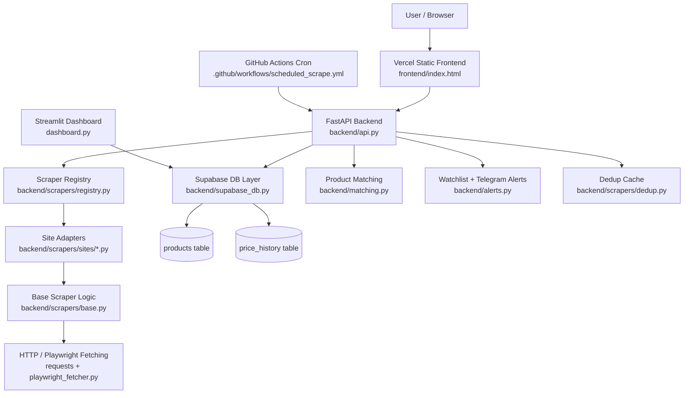
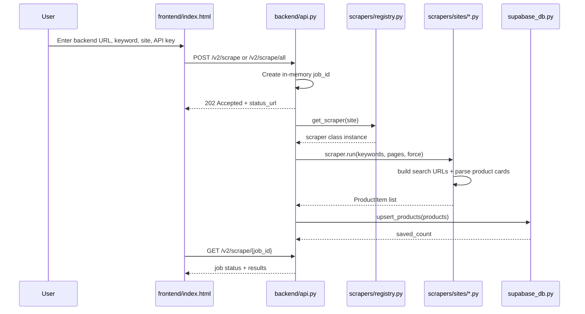
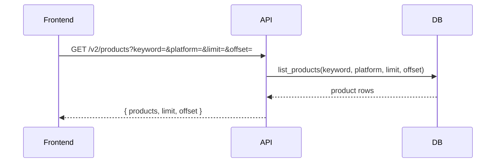
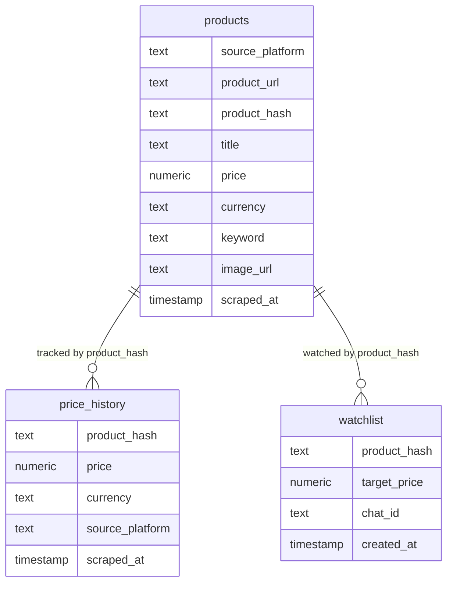
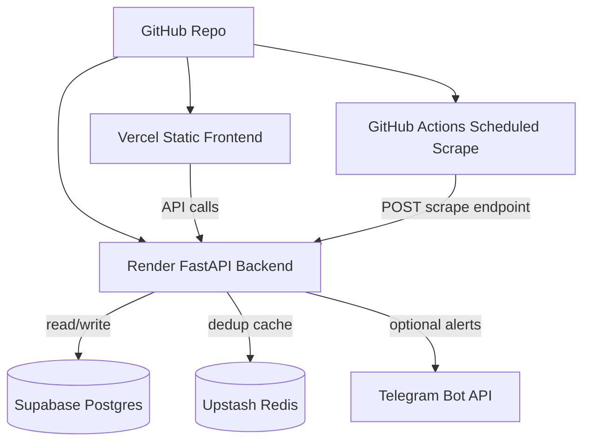

# SCRAPYv1 / SCRAPYv2 Project Graph

> Purpose: give Codex / AI coding tools a fast map of this repo so they do not need to re-scan every file before making changes.

## 1. What this project does

SCRAPY is a price-tracking web scraper application.

It has:

- **FastAPI backend** on Render
- **Static frontend** on Vercel
- **Supabase Postgres** for product and price history storage
- **Site scraper adapters** for ecommerce/product sites
- **Optional Redis / Upstash dedup cache**
- **Optional Playwright renderer** for JavaScript-heavy pages
- **Telegram alert support** for price-drop/watchlist flows
- **GitHub Actions scheduled scraping**
- **Optional Streamlit dashboard** via `dashboard.py`

## 2. High-level architecture



## 3. Main runtime flow

### Manual scrape from frontend



### Product browsing flow



### Cheapest / compare / history flow

```mermaid
graph LR
    C1[GET /v2/products/cheapest] --> DB1[cheapest_products]
    C2[GET /v2/products/compare] --> LP[list_products]
    LP --> MP[match_products]
    C3[GET /v2/products/{product_hash}/history] --> PH[product_history]
```

## 4. Repository map

```text
SCRAPYv1/
├── .github/
│   └── workflows/
│       └── scheduled_scrape.yml        # Scheduled scrape automation
├── backend/
│   ├── api.py                          # FastAPI app, routes, job orchestration
│   ├── alerts.py                       # Watchlist + Telegram price alert handling
│   ├── matching.py                     # Groups/matches similar products for comparison
│   ├── profiles.py                     # Scraper/site profile helpers if needed
│   ├── scraper_common.py               # Legacy/common scrape helper
│   ├── supabase_db.py                  # Supabase client + product/history DB functions
│   ├── run_scraper.py                  # CLI/script entry for scraper runs
│   ├── scrape_vijaysales.py            # Legacy VijaySales scraper
│   ├── scrape_webscraper_ecom.py       # Legacy generic webscraper ecommerce scraper
│   ├── scraper.py                      # Older scraper code / compatibility
│   ├── browser.context.py              # Browser context/config related file
│   ├── tracked_keywords.json           # Keywords for scheduled scraping
│   ├── requirements.txt                # Backend dependencies
│   ├── requirements-dev.txt            # Test/dev dependencies
│   ├── Dockerfile                      # Render/backend container config
│   ├── migrations/
│   │   └── 001_dedup.sql               # Supabase SQL schema changes
│   ├── scrapers/
│   │   ├── __init__.py
│   │   ├── base.py                     # BaseScraper + product normalization/filter logic
│   │   ├── dedup.py                    # Redis/Upstash URL dedup cache
│   │   ├── jsonld_adapter.py           # JSON-LD product extraction helper
│   │   ├── playwright_fetcher.py       # Playwright rendering/fetching helper
│   │   ├── registry.py                 # Registers supported scraper adapters
│   │   └── sites/
│   │       ├── __init__.py
│   │       ├── amazon_in.py            # Amazon India adapter
│   │       ├── croma.py                # Croma adapter
│   │       ├── flipkart.py             # Flipkart adapter
│   │       ├── gsmarena.py             # GSMArena adapter
│   │       ├── reliance_digital.py     # Reliance Digital adapter
│   │       └── vijaysales.py           # VijaySales adapter
│   └── tests/
│       ├── fixtures/
│       ├── test_base_scraper.py
│       ├── test_filters.py
│       ├── test_flipkart.py
│       ├── test_jsonld_adapter.py
│       └── test_matching.py
├── frontend/
│   ├── index.html                      # Static UI; calls backend APIs
│   └── cartoon-hybrid.css              # Frontend styling
├── public/                             # Static public assets, if any
├── scripts/
│   └── add_site.py                     # Scaffold a new scraper adapter
├── docs/                               # Project docs
├── dashboard.py                        # Optional Streamlit dashboard
├── requirements-dashboard.txt          # Dashboard dependencies
├── render.yaml                         # Render deployment configuration
├── vercel.json                         # Vercel static frontend routing/config
├── .env.example                        # Environment variable template
├── scraped.json                        # Legacy/local scraped output sample
└── vijaysales_mobiles.json             # Legacy/local VijaySales output sample
```

## 5. Backend API map

Primary file: `backend/api.py`

### Public/basic routes

| Route | Method | Purpose |
|---|---:|---|
| `/` | GET | Health-style landing response with registered scrapers |
| `/health` | GET | Checks API, DB, Redis, Playwright readiness, registered scrapers |
| `/scrapers` and `/v2/scrapers` | GET | Returns available scraper keys |

### Scrape routes

| Route | Method | Purpose |
|---|---:|---|
| `/scrape` | POST | Legacy scraper compatibility route |
| `/v2/scrape` | POST | Starts async scrape job for selected sites |
| `/v2/scrape/all` | POST | Starts async scrape job for all registered scrapers |
| `/v2/scrape/{job_id}` | GET | Polls async scrape status/results |

### Product routes

| Route | Method | Purpose |
|---|---:|---|
| `/products` and `/v2/products` | GET | List products from Supabase |
| `/products/cheapest` and `/v2/products/cheapest` | GET | Cheapest products for keyword |
| `/products/compare` and `/v2/products/compare` | GET | Match/group comparable products |
| `/products/{product_hash}/history` and `/v2/products/{product_hash}/history` | GET | Price history for one product hash |

### Watch route

| Route | Method | Purpose |
|---|---:|---|
| `/watch` and `/v2/watch` | POST | Adds product watch target for Telegram alert flow |

## 6. Key backend objects and responsibilities

### `backend/api.py`

Responsible for:

- FastAPI app setup
- CORS allowlist
- Request models: `ScrapeRequest`, `LegacyScrapeRequest`, `WatchRequest`, `Job`
- Async job creation and polling
- API key check for protected scrape routes
- Running scrapers with timeout
- Saving products to Supabase
- Running price alert evaluation
- Returning product list / cheapest / compare / history

Important global values:

- `JOBS`: in-memory job store. This resets when backend restarts.
- `SCRAPER_TIMEOUT_SECONDS`: default `420`. Set `0` to disable timeout.

### `backend/supabase_db.py`

Responsible for:

- Creating Supabase client from `SUPABASE_URL` and `SUPABASE_KEY`
- Upserting product rows into `products`
- Inserting price snapshots into `price_history`
- Listing products
- Getting cheapest products
- Getting product price history
- Basic DB health check

Important behavior:

- Product upsert conflict key: `source_platform,product_url`
- Price history insert is separate from product upsert
- Uses `product_hash` for history tracking

### `backend/scrapers/registry.py`

Responsible for:

- Importing scraper classes from `backend/scrapers/sites/*.py`
- Mapping site keys to scraper classes in `SCRAPERS`
- Returning a scraper instance through `get_scraper(site)`

When adding a new site, update this file.

### `backend/scrapers/base.py`

Responsible for shared scraper behavior:

- Product model / normalized output shape
- Keyword relevance filtering
- Price sanity checks
- Common run loop patterns
- Shared parsing helpers inherited by site adapters

### `backend/scrapers/sites/*.py`

Each file is one store/site adapter.

Expected pattern:

1. Subclass the shared base scraper.
2. Define site name/platform.
3. Build search URLs.
4. Fetch HTML via request or Playwright.
5. Parse product cards or JSON-LD.
6. Return normalized product objects.

Registered adapters currently visible:

- `amazon_in`
- `croma`
- `flipkart`
- `gsmarena`
- `reliance_digital`
- `vijaysales`

## 7. Database graph



Note: confirm exact columns in Supabase migration/schema before destructive schema changes.

## 8. Environment variables

Root file: `.env.example`

Expected variables:

```env
SUPABASE_URL=
SUPABASE_KEY=
UPSTASH_REDIS_REST_URL=
UPSTASH_REDIS_REST_TOKEN=
VERCEL_FRONTEND_ORIGIN=
SCRAPE_API_KEY=
TELEGRAM_BOT_TOKEN=
TELEGRAM_CHAT_ID=
SCRAPER_TIMEOUT_SECONDS=420
```

Behavior notes:

- `SCRAPE_API_KEY` protects `/v2/scrape` and `/v2/scrape/all` only.
- Public GET endpoints remain open.
- Local dev can omit `SCRAPE_API_KEY` if open scraping is acceptable.
- `VERCEL_FRONTEND_ORIGIN` should match deployed frontend URL for CORS.

## 9. Deployment graph



### Render

- Uses `render.yaml`
- Backend root: `backend`
- Start command should be similar to:

```bash
uvicorn api:app --host 0.0.0.0 --port $PORT
```

### Vercel

- Static frontend served from `frontend/**`
- `vercel.json` handles static routing
- Frontend should point to deployed Render backend URL

### GitHub Actions

- Workflow file: `.github/workflows/scheduled_scrape.yml`
- Uses repo variable `SCRAPE_API_URL`
- Uses repo secret `SCRAPE_API_KEY`
- Keywords controlled by `backend/tracked_keywords.json`

## 10. Common change guide for Codex

### Add a new ecommerce site adapter

Files to touch:

1. `backend/scrapers/sites/<new_site>.py`
2. `backend/scrapers/registry.py`
3. `backend/tests/test_<new_site>.py` or relevant fixture test
4. Possibly `backend/tracked_keywords.json` if scheduled scraping should include it

Use helper:

```bash
python scripts/add_site.py myshop
```

Then implement:

- `build_search_url()`
- parsing logic
- product normalization
- relevance filtering if site needs custom logic

### Fix frontend API behavior

Files to touch:

1. `frontend/index.html`
2. `frontend/cartoon-hybrid.css` only for style changes
3. Avoid backend changes unless endpoint contract is wrong

Check:

- Backend URL input/default
- API key header `x-api-key`
- Polling `/v2/scrape/{job_id}`
- Product list rendering from `/v2/products`

### Fix CORS / frontend cannot call backend

Files to touch:

1. `backend/api.py`
2. Render env var `VERCEL_FRONTEND_ORIGIN`

Check `allowed_origins` includes:

- Local frontend origin
- Vercel frontend origin
- Any Netlify/custom frontend origin if migrated

### Fix database save/list problems

Files to touch:

1. `backend/supabase_db.py`
2. `backend/migrations/*.sql`
3. Supabase SQL editor/schema

Check:

- `SUPABASE_URL`
- `SUPABASE_KEY`
- `products` table exists
- `price_history` table exists
- Unique constraint on `source_platform, product_url`
- Column names match serialized product dict

### Fix duplicate scraping / wasted fetches

Files to touch:

1. `backend/scrapers/dedup.py`
2. `backend/scrapers/base.py`
3. `backend/api.py` job save/mark-seen logic

Check:

- Upstash env vars
- `force` flag behavior
- URL mark-seen timing
- Avoid marking URLs before successful save

### Fix site parsing issues

Files to touch:

1. Relevant `backend/scrapers/sites/<site>.py`
2. `backend/scrapers/jsonld_adapter.py` if JSON-LD parsing is involved
3. Relevant tests/fixtures

Check:

- HTML selector changed
- Product cards hidden behind JS
- Playwright needed
- Price parser rejects valid price
- Keyword relevance filter too strict

### Fix price compare/grouping issues

Files to touch:

1. `backend/matching.py`
2. Tests: `backend/tests/test_matching.py`

Check:

- Product title normalization
- Variant/model extraction
- Price outliers
- Source platform grouping

### Fix Telegram alerts

Files to touch:

1. `backend/alerts.py`
2. `backend/api.py` only if route behavior changes
3. Supabase `watchlist` schema if needed

Check:

- `TELEGRAM_BOT_TOKEN`
- `TELEGRAM_CHAT_ID`
- `product_hash`
- Alert comparison logic

## 11. Local run commands

### Backend

```bash
cd backend
python -m venv .venv
.\.venv\Scripts\Activate.ps1
pip install -r requirements.txt
uvicorn api:app --reload
```

Backend local URL:

```text
http://127.0.0.1:8000
```

### Tests

```bash
cd backend
pip install -r requirements.txt -r requirements-dev.txt
pytest
```

### Dashboard

```bash
pip install -r requirements-dashboard.txt
streamlit run dashboard.py
```

## 12. API examples

### Start scrape for selected sites

```bash
curl -X POST "http://127.0.0.1:8000/v2/scrape" ^
  -H "Content-Type: application/json" ^
  -H "x-api-key: YOUR_KEY_IF_SET" ^
  -d "{\"sites\":[\"vijaysales\"],\"keywords\":[\"iphone 15\"],\"pages\":2,\"force\":false}"
```

### Poll job

```bash
curl "http://127.0.0.1:8000/v2/scrape/JOB_ID"
```

### List products

```bash
curl "http://127.0.0.1:8000/v2/products?keyword=iphone&limit=50"
```

### Cheapest products

```bash
curl "http://127.0.0.1:8000/v2/products/cheapest?keyword=iphone&limit=20"
```

## 13. Known design constraints / warnings

- `JOBS` is in-memory. Render restart = job history gone.
- Public GET product endpoints are open by design.
- Some raw files may be older legacy paths; prefer v2 flow for new work.
- Do not commit real `.env` secrets.
- Do not store service-role Supabase key in frontend.
- E-commerce sites can change selectors anytime; keep parsing defensive.
- Avoid scraping too aggressively. Add delays/backoff if needed.
- Playwright can be slow on Render; adjust timeout carefully.

## 14. Best Codex instruction to use with this file

Paste this at the start of Codex tasks:

```text
Read PROJECT_GRAPH.md first. Use it as the repo map. Do not re-scan the entire repository unless necessary. For changes, identify the smallest relevant file set from the graph, then patch only those files. Preserve existing API contracts unless I explicitly ask to change them. After changes, list exact files changed and how to test locally.
```

## 15. Suggested placement

Put this file at the repo root:

```text
PROJECT_GRAPH.md
```

Optional: also link it from `README.md`:

```md
## Developer / AI Repo Map
See [PROJECT_GRAPH.md](./PROJECT_GRAPH.md) before making code changes.
```
